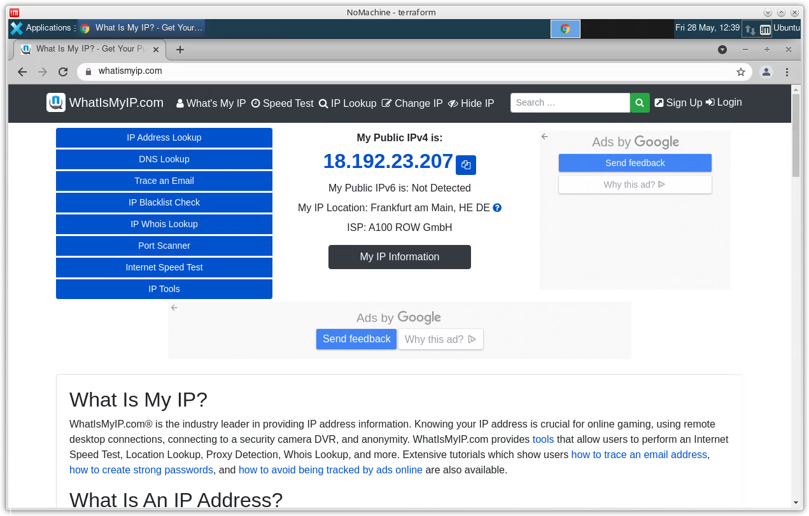

# Private remote browser in AWS

## What is this?

This Terraform setup can be used to privately browse the Internet, for situations where certain websites are blocked at network level or could contain harmful scripts. It creates temporary EC2 instance in AWS and install necessary software for NoMachine. After few minutes, user can connect and do anything via XFCE graphical interface, like visit questionable websites, download YouTube videos without restrictions etc.

## Why no VPN / Socks / SSH tunnels?

They all work fine, actually they work fine with this setup too! However, having a full GUI is useful for rare things like remote screen recording, also keeping the entire state on the remote machine prevents any shady cryptomining JS code (common on free movie sites) from running on my computers.

## How it works?

* Terraform creates AWS VPC and required network resources to run a remote desktop environment
* user-data scripts set up Ubuntu instance with Ansible playbook cloned from this GitHub repository
* Ansible provisions graphical Xubuntu environment with Firefox, Google Chrome and other tools
* NoMachine is set up to allow remote access

## How to run it?

Run `terraform apply`, then connect with NoMachine client (user `ubuntu`, port 4000) using public IP printed back at the end of apply. Everything is provisioned at runtime for cost saving. To clean up, run `terraform destroy`.

